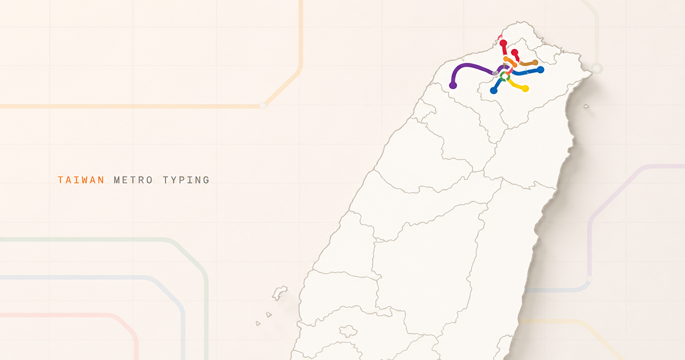

# TAIWAN METRO TYPING



以台灣捷運站名為題目的英文打字遊戲。首頁使用台灣行政區 TopoJSON，並依 WGS84 經緯度投影捷運站與路線。

## 功能

- 真實台灣海岸與縣市邊界
- 台北、新北與桃園捷運共 7 條路線、157 筆站點座標
- 依真實站序與經緯度繪製路線，支線以獨立 segment 呈現
- 選線放大、30 秒快打、全線挑戰
- WPM、正確率、完成站數與列車移動回饋
- 深色模式、鍵盤操作與響應式版面

## 技術架構

- pnpm 9
- Vite 5
- React 18
- d3-geo + topojson-client

## 本機執行

```bash
pnpm install
pnpm dev
```

開啟 <http://127.0.0.1:5173>。

正式建置：

```bash
pnpm build
pnpm preview
```

## 地圖與站點資料

- 台灣縣市邊界：[Taiwan.md 開源地圖資料集](https://taiwan.md/taiwan-shape/)，來源為 `waiting7777/taiwan-vue-components`，MIT 授權
- 捷運站、路線與站序：[TDX 運輸資料流通服務](https://tdx.transportdata.tw/)

重新下載台灣縣市邊界資料：

```bash
pnpm data:map
```

目前專案的捷運站點與路線資料皆來自 TDX。將手動下載的 `Line`、`Station` 與 `StationOfLine` JSON 放入 `data/` 後，重新產生 `public/data/metro.json`：

```bash
pnpm data:tdx-files
```

檔名格式為 `<operator>-line.json`、`<operator>-station.json` 與 `<operator>-station-of-line.json`，例如 `trtc-line.json`。目前需包含 TRTC、NTMC 與 TYMC 三個營運單位的完整資料；缺少檔案或必要路線時，匯入會直接失敗。

本專案不是捷運公司的官方服務，僅供打字練習使用。
