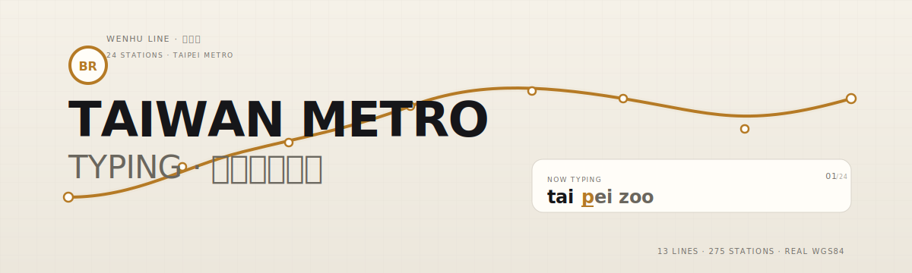
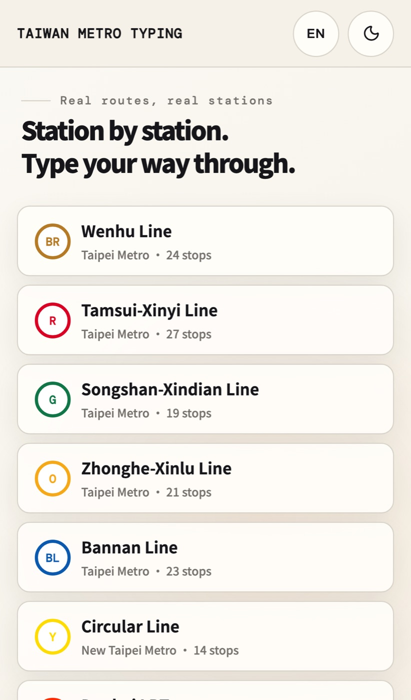
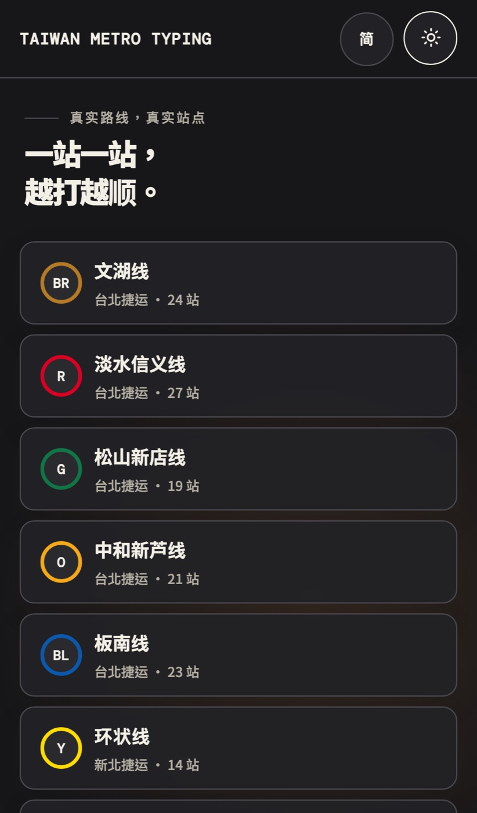
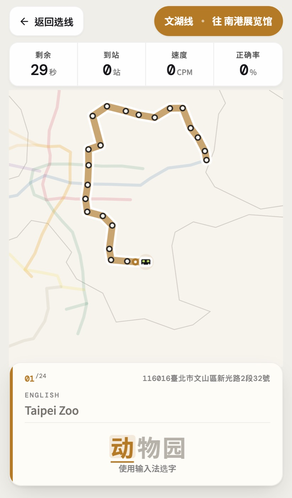
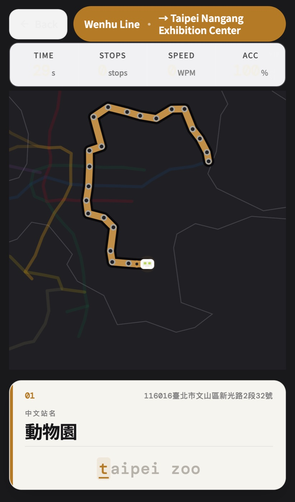

# TAIWAN METRO TYPING

<p align="center">
  
</p>

<p align="center">
  以 <strong>台湾捷运真实站点</strong> 为题的中英文打字练习。<br/>
  13 条路线 · 275 站 · 依 WGS84 经纬度绘制真实路径。
</p>

<p align="center">
  <a href="./LICENSE"></a>
  
  
  
  
</p>

---

## Preview

<table>
  <tr>
    <td width="50%"></td>
    <td width="50%"></td>
  </tr>
  <tr>
    <td></td>
    <td></td>
  </tr>
</table>

## 这是什么

- **一款打字练习工具**，不是「打字游戏」的营销皮。
- **题目来自真实运营数据** — 台北、新北、桃园、台中、高雄五个营运单位共 13 条路线的 275 个站点，直接接 TDX 运输资料流通服务 API。
- **地图不是装饰** — 台湾县市轮廓用官方 TopoJSON，捷运路径按 WGS84 经纬度投影，站点位置对得上真实地理。
- **中英双语打字** — 英文逐字校验；中文支援桌机 / 手机输入法拼字选字（compositionend 事件）。

## 玩法

1. 首页选一条捷运线路（默认展示台北，滚动可见新北 / 桃园 / 台中 / 高雄）
2. 选行驶方向（每条线有两个起讫方向）
3. 选模式：`30 秒快打` 或 `全线挑战`
4. 打字：正确一字，列车前进一段
5. 结束显示 WPM/CPM、正确率、完成站数

## 首次运行

```bash
# 使用 bun (Node 18+)
bun install
bun run dev
# → http://127.0.0.1:5173

# 生产建置
bun run build
bun run preview
```

## 技术

| Layer | Stack |
|---|---|
| Runtime | React 18 · Vite 5 |
| Style | 原生 CSS · CSS tokens · WCAG AA/AAA 焦点/对比检验 |
| Data | TDX Open API · d3-geo · topojson-client |
| I18n | 内置 en / zh-Hans / zh-Hant · opencc-js 简繁实时转换 |
| Test | node --test · Playwright E2E (`bun run test` · `bun run e2e`) |

## 数据

- **台湾县市边界**：[Taiwan.md 开源地图资料集](https://taiwan.md/taiwan-shape/)（来源 `waiting7777/taiwan-vue-components`，MIT）
- **捷运站点 / 路线 / 站序**：[TDX 运输资料流通服务](https://tdx.transportdata.tw/)

重新同步资料：

```bash
# 重新下载台湾行政区边界
bun run data:map

# 汇入 TDX 手动下载的 JSON (放入 data/ 目录)
bun run data:tdx-files
```

档名格式：`<operator>-line.json`、`<operator>-station.json`、`<operator>-station-of-line.json`（如 `trtc-line.json`）。
必须齐 TRTC / NTMC / NTDLRT / NTALRT / TYMC / TMRT / KRTC / KLRT 八个营运单位，缺档汇入直接失败。

## 无障碍

- **键盘全操作** — 路线选择、方向、模式、开始，全走 Tab / Enter / Esc
- **焦点可见** — 全局 `:focus-visible` 双色环（白内圈 + 蓝外圈 #006bff），暗色主题内圈自动切换
- **对比度守则** — 所有文本 WCAG AA 4.5:1；徽章边框、分隔线达 1.4.11 非文本 3:1
- **屏幕阅读器友好** — `aria-live` 通报当前站名与打字目标

## 声明

本专案不是任何一家捷运公司的官方服务，仅供打字练习使用。所有站点资讯来自 TDX 开放资料。

---

<p align="center">
  <sub>MIT License · 依 <a href="https://tdx.transportdata.tw/">TDX 运输资料流通服务</a> 的开放条款使用捷运数据</sub>
</p>
